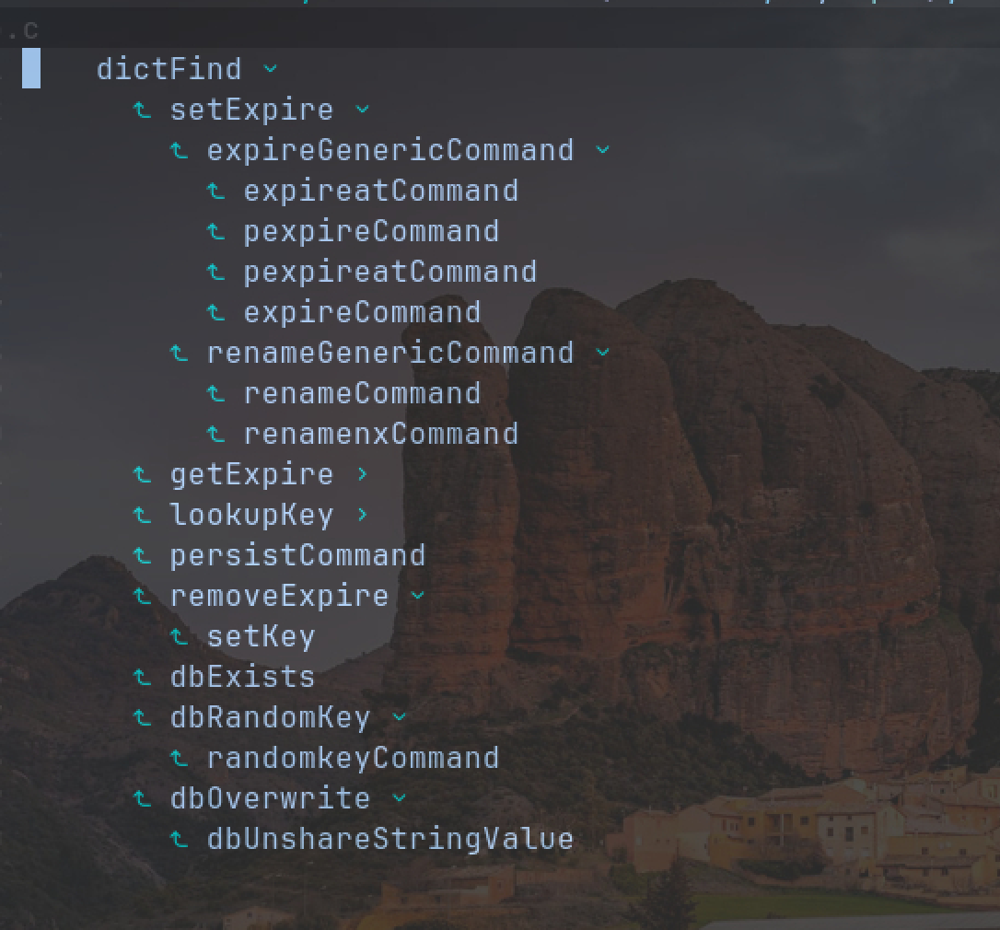
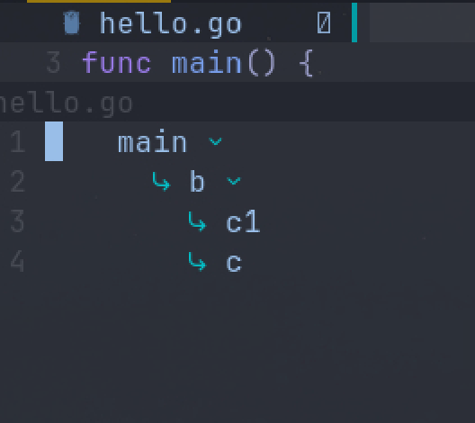

# lsp calltree

## demo
### incoming call

### outing call


## usage

### get it
for packer
```bash
  use {'MunifTanjim/nui.nvim'}
  use {'zhoupro/lsp-calltree'}
```
### set it
```bash
require('calltree').setup({})
```
### use it
- `IncomingTree` 被调用路径
- `OutingTree` 调用路径

- `h` 折叠 
- `l` 展开 
