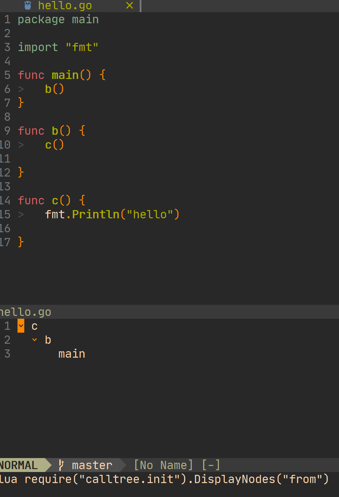
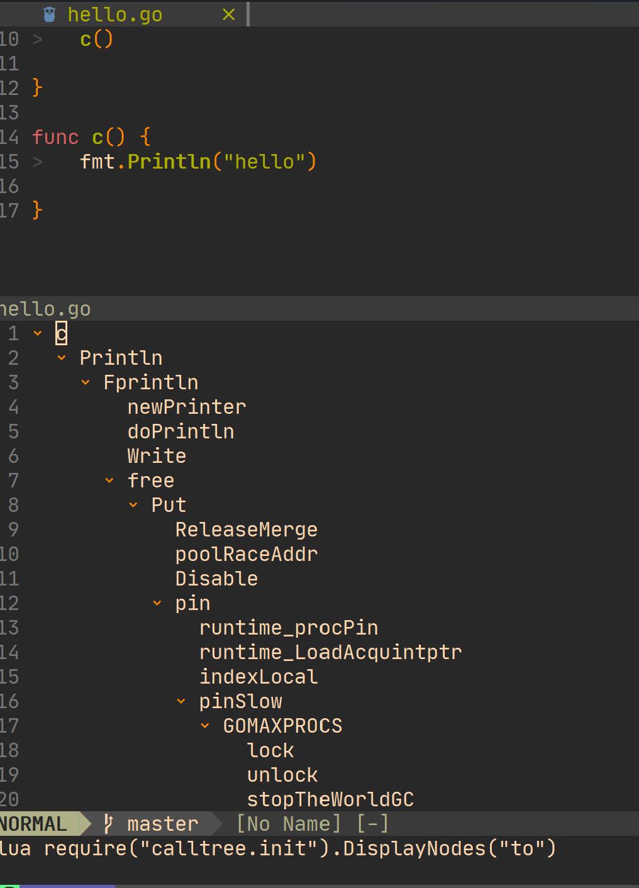

# lsp calltree

## demo
### incoming call


### outing call


## usage

### get it
for packer
```bash
  use {'MunifTanjim/nui.nvim'}
  use {'zhoupro/lsp-calltree'}
```
### set it
```bash
require('calltree').setup({})
```
### use it
use `IncomingTree` and `OutingTree` command
